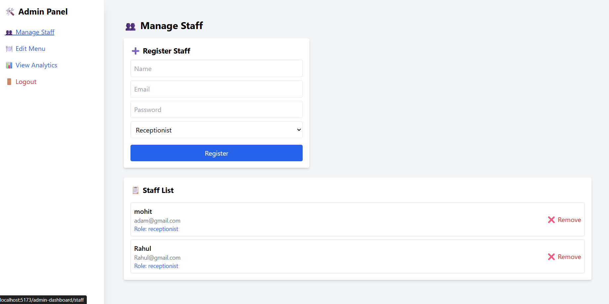
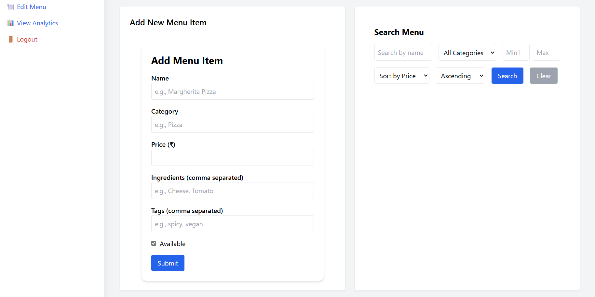
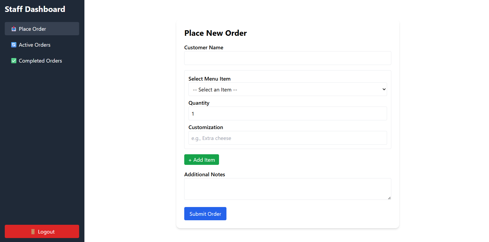
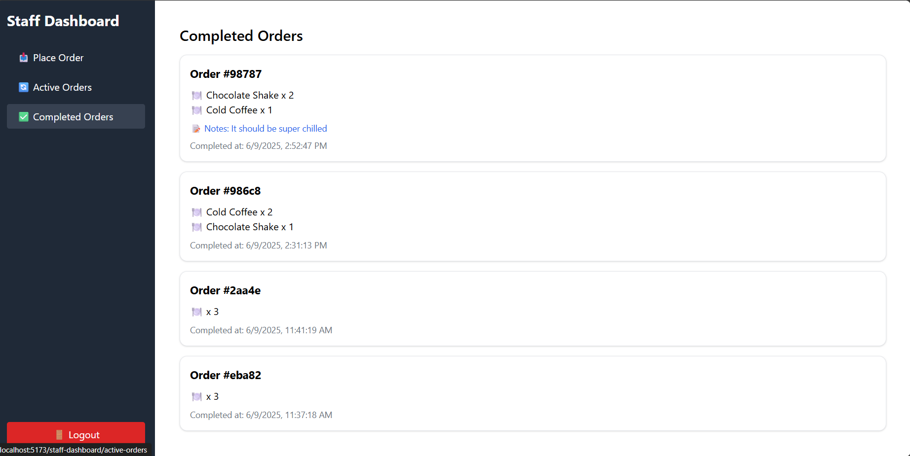

# 🍽️ Restaurant Menu & Order Management System

A full-stack application for managing restaurant operations including menu management, order placement, order tracking, staff access control, and admin analytics.

---

## 🔧 Tech Stack

| Frontend                 | Backend               | Database      |
|--------------------------|-----------------------|---------------|
| React + Tailwind CSS     | Node.js + Express.js  | MongoDB Atlas |

---

## ✨ Key Features

### 👨‍🍳 Staff Module
- Role-based login: `chef`, `waiter`, `receptionist`
- Place, update, cancel, and track in-progress orders
- View active and completed orders via dedicated dashboards

### 🧑‍💼 Admin Module
- Manage menu items (add/update/delete)
- Register and manage staff users
- Visual analytics using MongoDB aggregations:
  - Daily/Weekly Sales
  - Most Ordered Items
  - Revenue by Category
  - Peak Order Hours

---

## 📁 Backend Folder Structure

```
restaurant-backend/
├── controllers/
│   ├── menuController.js
│   └── orderController.js
├── middleware/
│   └── authMiddleware.js
├── models/
│   ├── MenuItem.js
│   ├── Order.js
│   └── User.js
├── routes/
│   ├── auth.js
│   ├── menu.js
│   ├── menuSearch.js
│   ├── orders.js
│   └── staff.js
├── .env
├── package.json
├── package-lock.json
└── server.js
```

---

## 📁 Frontend Folder Structure

```
src/
├── components/
│   ├── AddOrder.jsx
│   ├── LogoutButton.jsx
│   └── SearchMenu.jsx
├── pages/
│   ├── ActiveOrders.jsx
│   ├── AdminAnalytics.jsx
│   ├── AdminDashboard.jsx
│   ├── CompletedOrders.jsx
│   ├── Login.jsx
│   ├── ManageStaff.jsx
│   ├── MenuManagement.jsx
│   ├── OrderManagement.jsx
│   ├── PlaceOrder.jsx
│   ├── StaffDashboard.jsx
│   ├── StaffOrders.jsx
│   ├── UpdateMenuItem.jsx
│   └── UpdateOrder.jsx
├── App.jsx
├── App.css
├── index.css
├── main.jsx
└── .gitignore
```

---

## 🚀 Getting Started

### 🔌 Backend Setup
```bash
cd restaurant-backend
npm install
node server.js
```

> Ensure your `.env` file contains:
```
PORT=5000
MONGO_URI=your_mongo_connection_string
JWT_SECRET=your_jwt_secret
```

### 🌐 Frontend Setup
```bash
cd frontend
npm install
npm run dev
```

---

## 🔐 Authentication

- JWT-based login system
- Protected routes for Admin and Staff
- Local storage used to persist tokens on the frontend

---

## 📊 Admin Analytics

Charts and reports on:
- Daily / Weekly sales
- Most ordered dishes
- Category-wise revenue
- Peak hours of the day

---
## 📸 Screenshots

### 🧑‍💼 Admin Dashboard – Staff Management


### 🧑‍💼 Admin Dashboard – Edit Menu


---

### 👨‍🍳 Staff Dashboard – Place Order


### 👨‍🍳 Staff Dashboard – Completed Orders


## 👨‍💻 Developed By

- Devdeep Dhariwal

---

## 📃 License

This project is licensed under the MIT License.
